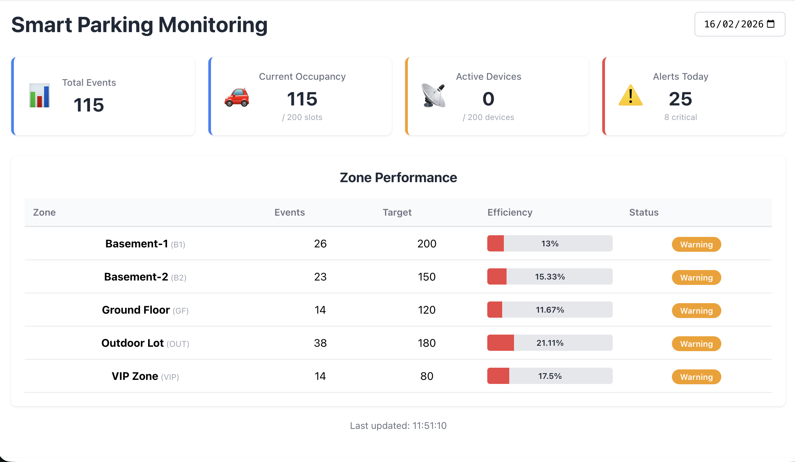
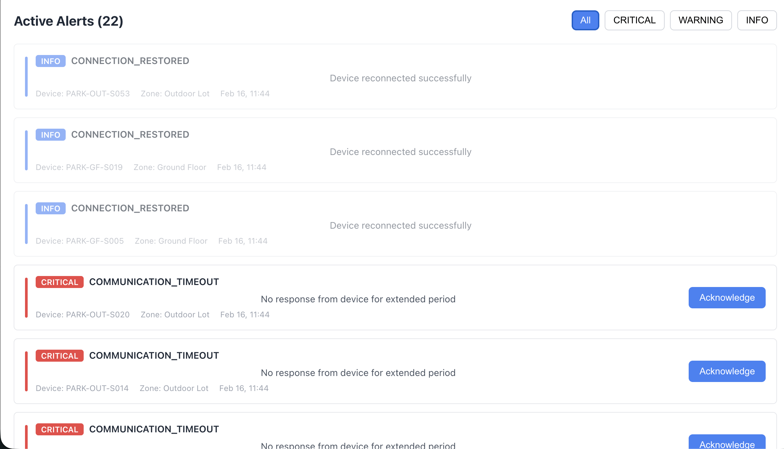

# Smart Car Parking Monitoring & Alert System

A real-time parking facility monitoring system built with Django REST Framework and React.

## Screenshorts

Dashboard

Alerts



## Completed Features

### Backend (Django + DRF)
- Clean data models for zones, devices, telemetry, parking logs, and alerts
- Telemetry data ingestion with validation
- Parking occupancy logging
- Dashboard summary API with metrics
- Alert system with severity levels (INFO, WARNING, CRITICAL)
- Duplicate alert prevention
- Business logic: abnormal power detection
- Zone-wise efficiency calculation vs targets
- Bulk telemetry ingestion endpoint

### Frontend (React)
- Real-time dashboard with 10-second polling
- Summary cards showing key metrics
- Zone performance table with efficiency indicators
- Active alert panel with severity filtering
- Alert acknowledgment functionality
- Date-based filtering

## Setup Instructions

### Prerequisites
- Python 3.8+ (Recommended)
- Node.js 14+
- pip and npm

### Installation
```bash
git pull https://github.com/MSCRAFI/smart_parking
```

### Backend Setup
```bash
cd smart_parking
cd backend
python -m venv venv
source venv/bin/activate  # Windows: venv\Scripts\activate

pip install -r backend/requirements.txt

python manage.py makemigrations
python manage.py migrate
python manage.py seed_data  # Creates sample zones and devices
python manage.py add_alerts # Creates sample alerts
python manage.py createsuperuser # to create superuser
python manage.py runserver
```

Access admin panel: http://localhost:8000/admin

### Frontend Setup
```bash
cd frontend
npm install
npm start
```

Access dashboard: http://localhost:3000

## Architecture Decisions

### Data Model Design
- **ParkingZone**: Represents physical parking areas with daily targets
- **Device**: IoT devices attached to parking slots with heartbeat tracking
- **TelemetryData**: Time-series operational data with composite unique constraint
- **ParkingLog**: Occupancy events for usage analysis
- **Alert**: Severity-based alerting with duplicate prevention

### Logics
1. **Offline Detection**: if devices not seen for >2 minutes trigger CRITICAL alerts
2. **Power Anomaly**: if consumption >1500W triggers WARNING alerts
3. **Efficiency Calculation**: (Actual Events / Daily Target) × 100%
4. **Duplicate Prevention**: Same alert type per device only created once until acknowledged

### Performance Considerations
- Database indexes on frequently queried fields (device_code, timestamp)
- Composite unique constraints prevent duplicate data
- Bulk ingestion endpoint for high-throughput scenarios
- Select_related/prefetch_related for optimized queries

## Incomplete Features

Due to the 20-hour time constraint, the following were not implemented:

1. **Device Health Scoring**: The 0-100 health score based on uptime and alert frequency
2. **Advanced Visualizations**: Charts for hourly usage trends and time-series analysis
3. **CSV/Excel Export**: Download functionality for reports
4. **Advanced Filters**: Device-specific filtering and date range queries
5. **WebSocket Integration**: Real-time push notifications instead of polling


## What I Would Implement Next

### Short-term
1. Device health scoring algorithm
2. Recharts integration for usage trends
3. CSV export functionality using Django's StreamingHttpResponse
4. Enhanced filtering with query parameters

### Medium-term
1. WebSocket/Server-Sent Events for real-time updates
2. Device configuration management
3. Historical data aggregation tables for faster queries
4. User authentication and role-based access
5. Automated background tasks using Celery

## What changes would you make if this system had 5,000 devices sending data every 10 seconds?


### Immediate Changes
1. **Database**:

I would switch to PostgreSQL with TimescaleDB extension for time series data. I would also partition tables by date and would also use retention policy and indexes for faster queries

2. **Caching**:

I would use Redis cache for dashboard summary. I would also use cache device status to avoid repeated DB queries.

3. **Data Ingestion**:

For this I would use mandatory bulk endpoints, message queue(Redis), async workers and rate limiting.

4. **API Optimization**:

I would use pagination to specify default items number and can limit max items. Also, Field limiting be used to return only necessary fields. Then Compressed responses by enabling gzip and by creating separate db for dashboard queries api can be further optimized.


## Technology Stack
- **Backend**: Django, Django REST Framework
- **Frontend**: React, Axios
- **Database**: SQLite (PostgreSQL recommended for production)
- **Styling**: Vanilla CSS

## Implement PostgreSQL

Paste this in place of default DATABASES.
```

DATABASES = {
    'default': {
        'ENGINE': 'django.db.backends.postgresql',
        'NAME': 'myproject', # DB Name
        'USER': 'myprojectuser', # DB USERNAME
        'PASSWORD': 'mypassword', # DB PASSWORD
        'HOST': 'localhost',
        'PORT': '', # Empty string uses default port 5432
    }
}


```